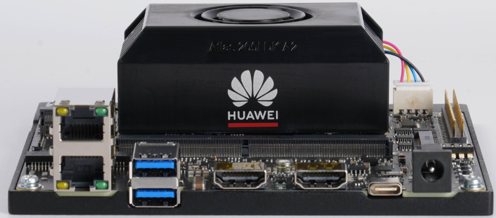
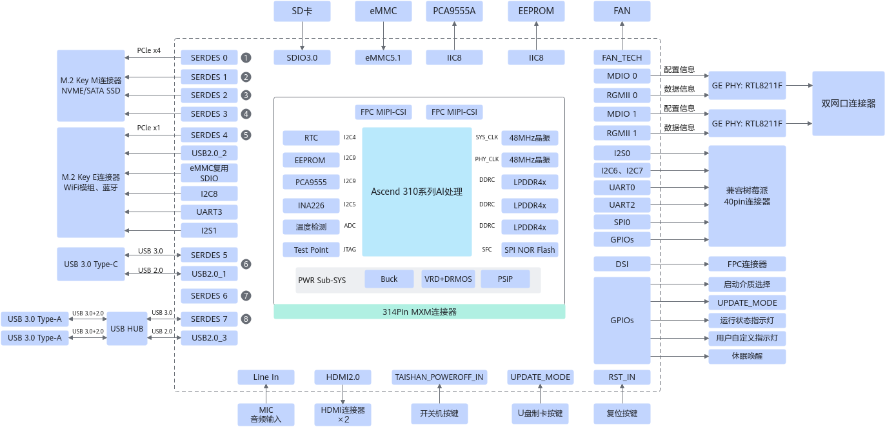
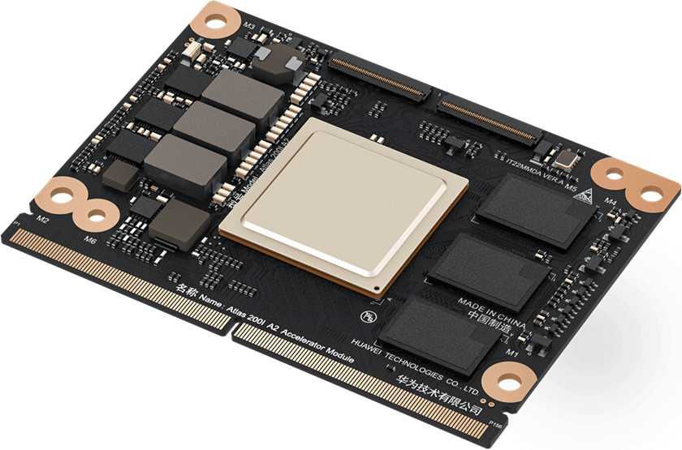
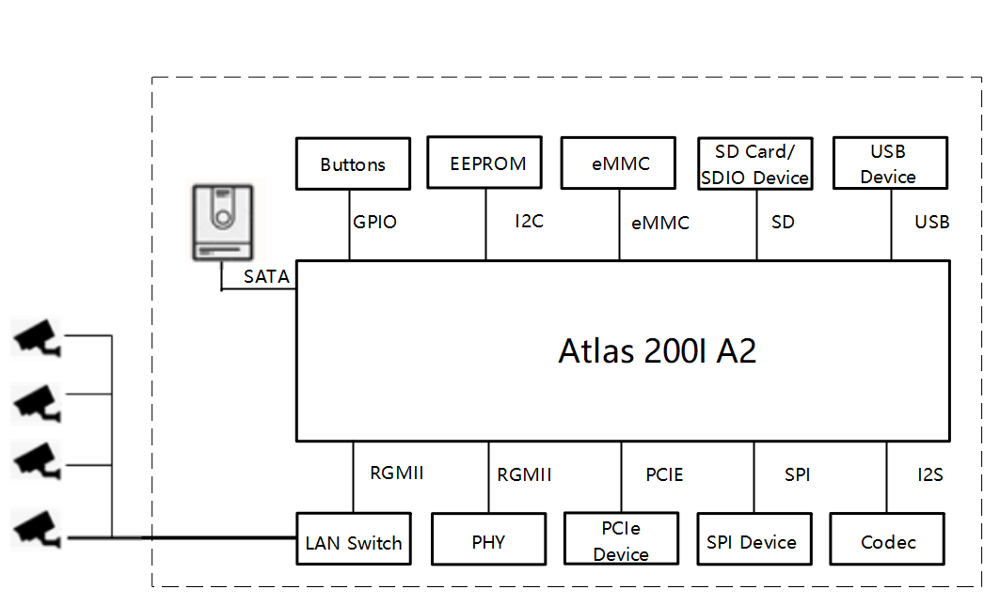
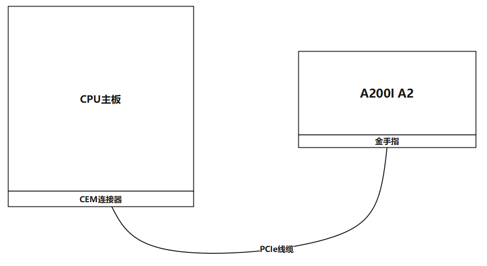
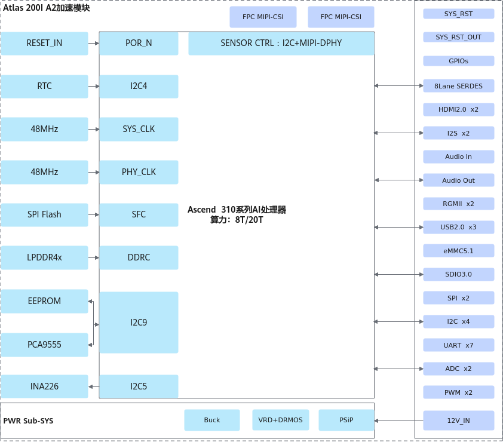
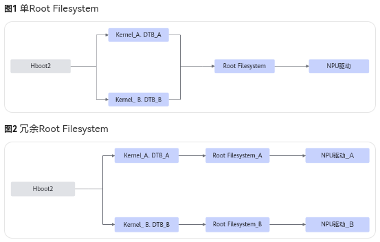
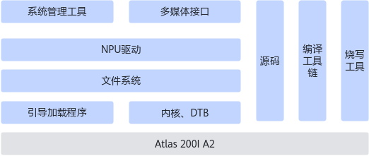
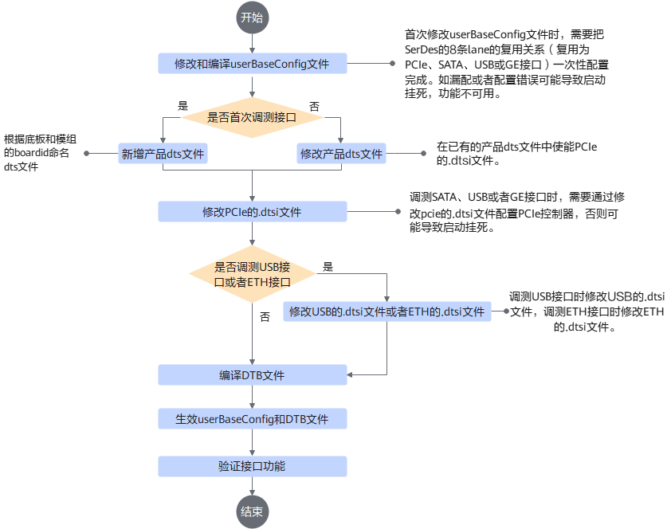
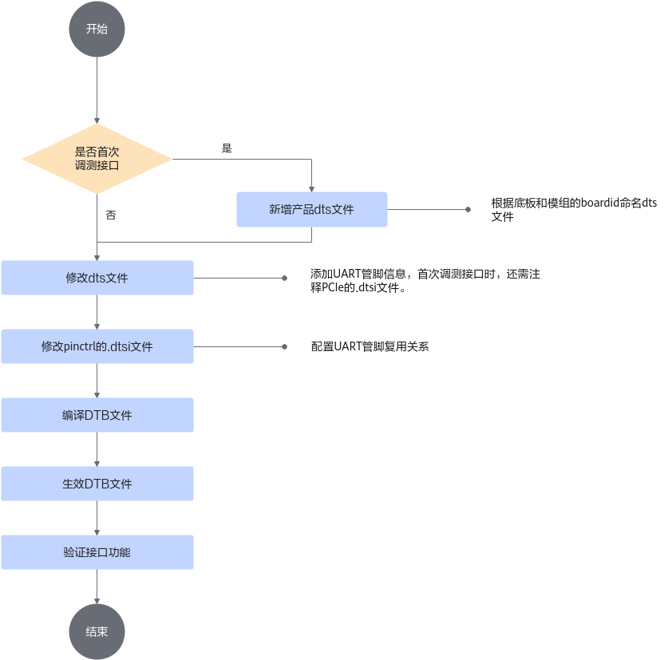

# Atlas 200I A2(310B) 驱动开发

若有软实时OS需求时，需使用的OS为openEuler-22.03-LTS-SP1

(软件包链接)[https://www.hiascend.com/hardware/firmware-drivers/old/community?product=1&model=23&cann=8.5.1&driver=Ascend+HDK+25.5.1]

(根文件系统样例)[https://www.hiascend.com/hardware/firmware-drivers/old/community?product=1&model=23&cann=All&driver=2023.0.T10]

(CANN 软件包)[https://www.hiascend.com/developer/download/community/result?from=firmware&product=1&model=23&cann=8.5.1]

(Ubuntu 系统镜像)[https://old-releases.ubuntu.com/releases/22.04.1/ubuntu-22.04-live-server-arm64.iso]

(OpenEular 系统镜像)[https://dl-cdn.openeuler.openatom.cn/openEuler-22.03-LTS-SP3/ISO/aarch64/openEuler-22.03-LTS-SP3-aarch64-dvd.iso]

Altas 200I DK A2 是华为推出的AI开发者套件，搭载华为自研的Ascend 310B AI芯片，支持AI推理。

图为华为官方开发者套件系统框图。

## 产品简介

### 应用模式

310B 根据外部硬件设计的不同，可分为两种应用模式，分别是主处理器（RC-Root Complex场景）、协处理器（EP-End Point场景）。推荐使用主处理器模式。

#### RC 场景

310B 内部有4个TAISHANV200M处理器核，最高主频1.6GHz，提供常见的I2C、USB、SPI、RGMII等外设接口，可以作为嵌入式系统CPU使用。

#### EP 场景

310B 内部集成了一个DaVinciV300 AI core，最高主频1.224GHz（20TOPS），支持AI计算框架，推理场景下支持FP16、INT8数据格式。
支持Ubuntu和OpenEular操作系统，可通过PCIe连接线等方式与CPU主板进行连接，以处理AI相关的计算操作。

### 接口说明

简要说明支持的接口

**SerDes接口**

310B 提供8 Lane SerDes，分布在2个SerDes Macro中，可以根据不同产品的应用场景，实现GE、USB3.0、PCIe和SATA的灵活配置。

支持标准和复用关系如下：
- GE-1000BASE-R（1.25Gbps），SGMII（3.125Gbps/1.25Gbps，支持2.5GE和GE）
- USB3.0（5Gbps）
- SATA3.0（6Gbps），向下兼容SATA2.0（3Gbps）和SATA1.0（1.5Gbps）
- PCIe Gen3（8Gbps），向下兼容PCIe Gen2（5Gbps）和PCIe Gen1（2.5Gbps）
- PCIe0 支持RC/EP模式（通过PCIE_EP_RC_FLAG管脚配置），其他PCIe只支持RC模式
- Macro0 中若存在PCIe和其他协议共存，则PCIe只能支持到PCIe Gen2
- PCIe支持降Lane应用

**RGMII接口**

310B集成有两个RGMII控制器。RGMII（Reduced Gigabit Media Independent Interface）是一种精简的GMII接口，通过参考时钟的上升下降沿都采样数据的方式，实现精简数据线和控制线的数量。
该接口用于 1000Mbps/100Mbps/10Mbps 的以太网MAC层和PHY层之间的以太网数据传输。

**SDIO接口**

310B上集成了1个SDIO接口，支持对接SDXC卡，向下兼容SDHC卡。

**eMMC接口**

310B提供1个eMMC（Embedded Multi-Media Card）控制器用于处理对eMMC器件的命令收发、数据读写等操作。
- 支持SDMA/ADMA2方式的DMA传输。
- 支持命令、数据的CRC校验。

**USB接口**

310B支持4路USB3.0，即USB3.0_0~USB3.0_3
- USB0 仅支持USB3.0 HOST模式，不支持USB DEVICE模式，不支持USB2.0
- USB1 支持USB2.0 HOST+DEVICE模式，USB3.0 HOST+DEVICE模式
- USB2~USB3支持USB2.0 HOST模式，USB3.0 HOST模式

**UART接口**

UART（Universal Asynchronous Receiver/Transmitter），即通用异步接收发送器，是AMBA的SOC外设，挂在APB总线上。UART完成接收数据的串并转换和发送数据的并串转换。  
310B可提供7路UART接口。

- 数据位和停止位位宽可配：数据位可配置为5/6/7/8bit，停止位可配置为1/2bit。
- 支持奇、偶校验方式或者无校验位。
- 传输速率编程可配。
- UART2、UART3控制器支持流控。
- UART发送FIFO深度为64bit，宽度为8bit；接收FIFO深度为64bit，宽度为12bit。
- 支持接收FIFO中断、发送FIFO中断、接收超时中断和错误中断可以分别进行屏蔽，产生一个组合中断。

**MIPI CSI接口**

MIPI（Mobile Industry Processor Interface），移动行业处理器接口。MIPI是MIPI联盟发起的为移动应用处理器制定的开放标准。  
CSI-2（Camera Serial Interface 2）是MIPI联盟定义的一种高速串行接口，主要用于摄像模组和处理器之间的连接。

310B可提供2路MIPI CSI-2接口，支持如下协议：
- 支持标准MIPI CSI-2 v1.2协议。
- mmDPHY接口可支持标准DPHY协议。
- 可同时支持4路sensor输入，最大支持4096x2160@45fps。
- 单路最多支持8-Lane MIPI DPHY接口，最大支持2.5Gbps/Lane。
- 支持RAW8/RAW10/RAW12/RAW14数据类型解析。
- 支持YUV420 8-bit/YUV422 8-bit数据类型解析。
- 支持最大4路virtual channel。
- 最多支持2帧WDR，支持多种WDR时序。
310B可提供多种控制信号，特性如下：
- 每个CSI接口支持2路PWM信号，可用于光圈调节。
- 每个CSI接口支持1路VS信号、1路HS信号，分别用于场同步和行同步。
- 每个CSI接口支持1路CAM_GPIO信号，可用于电源使能控制。

**MIPI DSI接口**

DSI-2（Display Serial Interface）接口是MIPI联盟定义的一种高速串行接口，主要用于处理器和显示模块之间的连接。

**HDMI TX接口**

310B 支持两个HDMI接口，均支持HDMI 2.0（High Definition Multimedia Interface）协议。

**I2S接口**

I2S（Inter-IC Sound）为音频数据传输协议，由Philips制定。它采用了沿独立的导线传输时钟与数据信号的设计，通过将数据和时钟信号分离，避免了因时差诱发的失真。  
310B提供了2个通用I2S口，I2S0与I2S1。

**I2C接口**

310B共支持7路I2C接口，其中1路为Slave，6路为Master。

I2C接口特性：
- 只支持I2C总线上作为master，不支持多master（不支持仲裁/同步）
- 支持I2C总线上作为接收器或发送器
- 作为主设备时支持的从设备的地址：标准地址（7位）和扩展地址（10位）
- 支持标准模式100kbit/s、支持快速模式400kbit/s 、支持高速模式3.4Mbit/s
- 支持1bit组合中断信号输出，高电平有效
- 支持中断上报、中断屏蔽、中断状态查询
- 总线时钟和参考时钟必须使用同一时钟

**SPI接口**

SPI（Serial Peripheral Interface）控制器，可以作为一个主设备与外部的设备来进行同步串行通信，主要应用于外接触摸屏、SD卡、Wi-Fi和TPM等。  
310B 共支持6组SPI接口。

## 驱动开发

Atlas 200I A2 加速模块的逻辑架构。

### 基础概念

Atlas 200I A2 加速模块出厂自带固件，完成底板设计后，需要将驱动和系统安装至整机设备。

Atlas 200I A2 加速模块支持将驱动和系统烧录至SD卡、M.2或者eMMC，再从SD卡、M.2或者eMMC启动设备。

**SerDes功能**
可根据不同产品的应用场景，实现GE、USB3.0、PCIe和SATA的灵活组网。  
用户可通过 userBaseConfig 灵活配置 SerDes，详见：[编译并生效userBaseConfig文件](https://www.hiascend.com/document/detail/zh/Atlas%20200I%20A2/260RC1/RC/driverdevelopmentguide/atlasdg_11_0116.html)。

**Hboot2**

在Atlas 200I A2 加速模块的SFC Flash上预置了Hboot2程序，可根据BOOTSEL真值表选择启动介质，从启动介质中加载Kernel、DTB等程序。

**文件系统**

烧录工具支持单Root Filesystem和冗余Root Filesystem两种文件系统，可使用boot_tool工具查询文件系统启动的相关信息。例如boot_tool get image_info查询Root Filesystem所在的分区信息。

**DTB文件**

Atlas 200I A2 加速模块通过提供dt.img镜像集成不同的DTB，Hboot2根据Atlas 200I A2 加速模块的adc_board_id和底板的adc_board_id从dt.img中选择匹配的DTB并加载，当无匹配的DTB时会加载dt.img中的第一个DTB。

**userBaseConfig文件**

userBaseConfig文件为弹性配置，可通过userBaseConfig文件配置SerDes信息， 将SerDes复用为PCIe、SATA、USB或者GE接口。

### 系统架构

驱动软件主要包括引导加载程序、内核、DTB、文件系统、NPU驱动、源码、编译工具链以及烧写工具。

### 用户必读

Atlas 200I A2 加速模块的adc_board_id可通过算力区分不同的硬件类型。  
- 当算力为20T时，Atlas 200I A2 加速模块的adc_board_id为150；
- 当算力为8T时，Atlas 200I A2 加速模块的adc_board_id为100。

底板的adc_board_id可通过底板的实际硬件电路中的电阻取值获得。  
设备启动成功且登录系统之后，可使用命令`npu-smi info -t board -i id`查询底板的Board ID。

编译DTB时，需要提前配置dts文件，dts中boardid字段请务必配置为用户实际使用底板的adc_board_id与Atlas 200I A2 加速模块的adc_board_id的组合值，例如底板的adc_board_id为33，Atlas 200I A2 加速模块的adc_board_id为150，则boardid的取值为33150。  
设备启动成功且登录系统之后，可使用命令`npu-smi info -t board -i id -c chip_id`查询指定NPU芯片的整机Board ID。

设备快速启动编译DTB时，DTB中PCIe配置已删除，二次开发时若需要使用，用户需要根据底板设计修改对应的user_base_config.xml文件和DTB文件。

### 开发前准备

|  流程阶段  | 说明                               |
| :--------: | :--------------------------------- |
| 下载软件包 | 下载开发流程中所需的软件包         |
|  准备环境  | 根据不同开发场景准备对应的环境     |
|  烧写镜像  | 有提供SD卡启动镜像文件             |
|  启动设备  | 上电                               |
|  接口调测  | 调测外设接口，使外设接口能正常通讯 |
| 产品化设置 | 可以定制自己的MAC地址              |

#### 下载软件包

| 软件包                                   | 包名称                                                          | 说明                                                                                                                                                                                                                                                                                                                                                                                                                                                                                                                             |
| ---------------------------------------- | --------------------------------------------------------------- | -------------------------------------------------------------------------------------------------------------------------------------------------------------------------------------------------------------------------------------------------------------------------------------------------------------------------------------------------------------------------------------------------------------------------------------------------------------------------------------------------------------------------------- |
| 工具包 (源码、编译工具链、烧写等工具) | Ascend-hdk-310b-sdk-soc_\<version\>.zip                         | 解压后获取如下软件包： - 工具链安装包 **toolchain.tar.gz** - 源码包 **Ascend310B-source.tar.gz** - 制卡脚本工具包 **sdtool.tar.gz** - vrd升级工具包 **vrdtool.tar.gz** - efuse烧写工具包 **efuse-tool.tar.gz** - emmc镜像制作工具包 **emmc_burn_tool.tar.gz** - hdmi验证工具包 **hdmi_sample.tar.gz** - audio验证工具包 **audio_sample.tar.gz** - hdm软件包 **A500-A2-hdm_\<version\>.zip** (解压后获取 **A500-A2-hdm_\<version\>.tar.gz**) \<version\>表示NPU版本号，具体请根据实际情况进行替换。 |
| HBoot2源码包                             | Ascend-hdk-310b-hboot2-sdk-soc_\<version\>.zip                  | 开源包。 解压后获取如下软件包： Ascend310B-hboot2-source.tar.gz \<version\>表示NPU版本号，具体请根据实际情况进行替换。                                                                                                                                                                                                                                                                                                                                                                                                  |
| 恢复出厂镜像包                           | Ascend-hdk-310b-npu-soc_\<version\>_linux-aarch64.zip           | 解压后获取 **Ascend-hdk-310b-npu-soc_\<version\>_linux-aarch64.tar.gz**，**Ascend-hdk-310b-npu-soc_\<version\>_linux-aarch64.tar.gz.cms**和**Ascend-hdk-310b-npu-soc_\<version\>_linux-aarch64.tar.gz.crl**。 \<version\>表示NPU版本号，具体请根据实际情况进行替换。                                                                                                                                                                                                                                                          |
| 恢复出厂镜像包                           | Ascend-hdk-310b-npu-soc_\<version\>_linux-rt-aarch64.zip        | 解压后获取 **Ascend-hdk-310b-npu-soc_\<version\>_linux-rt-aarch64.tar.gz** 若有软实时OS需求，可使用此驱动包。 \<version\>表示NPU版本号，具体请根据实际情况进行替换。                                                                                                                                                                                                                                                                                                                                                       |
| 驱动包                                   | Ascend-hdk-310b-npu-driver-soc_\<version\>_linux-aarch64.run    | \<version\>表示NPU版本号，具体请根据实际情况进行替换。                                                                                                                                                                                                                                                                                                                                                                                                                                                                           |
| 驱动包                                   | Ascend-hdk-310b-npu-driver-soc_\<version\>_linux-rt-aarch64.run | 若有软实时OS需求，可使用此驱动包。 \<version\>表示NPU版本号，具体请根据实际情况进行替换。                                                                                                                                                                                                                                                                                                                                                                                                                                     |
| 固件包                                   | Ascend-hdk-310b-npu-firmware-soc_x.x.x.x.X.run                  | *x.x.x.x.X*表示NPU固件版本号，具体请根据实际情况进行替换。                                                                                                                                                                                                                                                                                                                                                                                                                                                                       |

### 制作和烧写启动镜像

Atlas 200I A2 加速模块提供两种方法通过SD卡制作和启动系统镜像。
- 方法一：将驱动和系统直接烧写至SD卡，再将SD卡插入，SD卡作为启动盘启动。  
- 方法二：将驱动和系统制作成启动镜像（该镜像默认使能主备分区，并开启了主备同步功能），再将启动镜像烧写至SD卡，然后将SD卡插入，SD卡作为启动盘启动。  

#### 方法一

##### 修改 dts 并编译 DTB

用户需要根据自己的底板适配自己的dt.img文件。  
Hboot2根据Atlas 200I A2 加速模块的adc_board_id和底板的adc_board_id在dt.img中选择匹配的DTB加载，当无匹配的DTB时会加载默认DTB文件。

> 操作步骤
> 1. 登录Linux服务器。
> 2. 执行 `su - root`，切换至root用户。
> 3. 将源码包 `Ascend310B-source.tar.gz` 上传至 Linux 系统 root 用户属组目录，例如 `/opt`。
> 4. 执行 `cd /opt`，进入源码包所在目录。
> 5. 执行 `tar -xzvf Ascend310B-source.tar.gz`，解压源码包。
> 6. 执行 `cd Ascend310B-source/dtb/dts/hi1910b/hi1910BL`，进入 `hi1910BL` 目录。（310B的丝印是hi1910，BL指Board Layer）。
> 7. 默认加载最小集 `hi1910B-default.dts`。
> 8. 添加适配产品 boardid 的 dts 文件。
> 9. 执行 `cd /opt/Ascend310B-source/dtb/dtbtool/`，进入`dtbtool`目录。
> 10. 修改`CMakelists.txt`文件，将所增加的dts添加到编译路径中。
> 11. 重新编译生成`dt.img`文件。
>     - 返回 `Ascend310B-source`目录。
>     - 执行 `bash build.sh dtb`，编译 dtb 文件。
> 12. 把编译生成 `dt.img` 文件重构入驱动 run 包。

##### 重构驱动 run 包

用户新增或替换驱动包中的 image、dt.img、驱动文件（ko文件）或驱动文件的加载脚本等，需要进行驱动包的重构。

> 操作步骤
> 1. 登录Linux服务器。
> 2. 执行 `su - root`，切换至root用户。
> 3. 将源码包 `Ascend310B-source.tar.gz` 上传至 Linux 系统 root 用户属组目录，例如 `/opt`。
> 4. 执行 `cd /opt`，进入源码包所在目录。
> 5. 执行 `tar -xzvf Ascend310B-source.tar.gz`，解压源码包。
> 6. 执行 `cd Ascend310B-source`，进入`Ascend310B-source`目录。
> 7. 将驱动包 `Ascend-hdk-310b-npu-driver-soc_<version>_linux-aarch64.run` 上传至 `Ascend310B-source` 目录下。
> 8. 执行 `chmod u+x Ascend-hdk-310b-npu-driver-soc_<version>_linux-aarch64.run`，为驱动包添加可执行权限。
> 9. 执行 `bash Ascend-hdk-310b-npu-driver-soc_<version>_linux-aarch64.run --noexec --extract=./repack`，解压驱动包进行修改。
> 10. 执行 `bash build.sh repack ./Ascend-hdk-310b-npu-driver-soc_<version>_linux-aarch64.run`，编译打包驱动。

##### SD卡制作系统镜像

先跳过

#### eMMC 制作和启动系统镜像

**制作镜像**

> 1. 将U盘插入Linux服务器。
> 2. 登录Linux服务器。
> 3. 执行 `su root`，切换至root用户。
> 4. 将工具包中解压到的制卡所需软件包`sdtool.tar.gz`、驱动包`Ascend-hdk-310b-npu-driver-soc_<version>_linux-aarch64.run`(若有软实时OS需求，不能直接使用rt驱动包，该驱动包需要用户自行编译生成内核 Image 文件后进行重构，用户使用重构后的驱动包) 和 系统镜像、根文件系统镜像上传至 root 用户所属组目录下，例如`/home/ascend/mksd`。
> 5. 执行 `cd /home/ascend/mksd`，进入 sdtool.tar.gz 制卡脚本工具包的上传目录。
> 6. 执行 `tar -xzvf sdtool.tar.gz`，解压制卡脚本工具包。
> 7. 执行 `cp -arf sdtool/* ./`，将解压后的文件拷贝至制卡脚本工具包所在目录。
> 8. 执行 `cd ./recovertool`，进入 `recovertool` 目录。
> 9. 将软件包放到 recovertool 目录 ？？？ 软件包名和前面的不同
> 10. (可选)更改网线和USB的默认IP地址。
>     a. 执行 `cd /home/ascend/mksd`，进入制卡脚本工具包所在目录。
>     b. 执行 `vim make_sd_card.py`，更改网线和USB的默认IP地址。
> 11. (可选)执行 `vim /home/ascend/mksd/mksd.conf`，修改 `FAST_BOOT_FLAG` 的值为 on，打开快速启动配置。
> 12. (可选)自定义分区配置
>     a. 解压驱动run包，获取`restore_factory.sh` 脚本。
>     b. 拷贝 `restore_factory.sh`脚本到`recovertool`目录。
>     c. 修改分区设置。
> 13. 在脚本工具包所在目录执行`./emmc-head --help`，检查`emmc-head` 工具是否可用。
> 14. 执行 `python3 make_sd_card.py mkrecoverimg eMMC`，制作烧写到 eMMC 的恢复出厂镜像。
> 15. 根据打印提示信息输入"Y"。
> 16. 替换软实时OS需求的驱动包、ISO 和 文件系统镜像。
> 17. 执行 `fdisk -l`，查找USB设备名称。
> 18. 执行 `python3 make_sd_card.py local /dev/sdx USB`，制作U盘。
> 19. 根据打印提示信息输入"Y"。
> 20.（可选）执行`fdisk -l`查看分区信息。

**烧写镜像和启动设备**

上电的同时按下update按键进入U盘启动模式，等待eMMC烧写。

执行`npu-smi info -t health -i 0`，检查设备健康状态。

### 接口外设调测参考

#### SerDes

SerDes接口提供8条lane，可通过配置 userBaseConfig 中 lane 属性将 SerDes 复用为PCIe、SATA、USB 或者 ETH接口。

Atlas 200I A2 加速模块出厂自带固件(userBaseConfig.bin)文件，需要用户根据底板设计修改对应的 user_base_config.xml 文件和 DTB 文件。

##### PCIe 接口调测

**前提条件**

已经获取设备 boardid。

**修改和编译 userBaseConfig 和 DTB 文件**

> 1. 登录Linux服务器。
> 2. 执行 `su root`，切换至root用户。
> 3. 将源码包`Ascend310B-source.tar.gz`上传至root用户属组目录下，例如`opt`。
> 4. 执行 `cd /opt`，进入源码包所在目录。
> 5. 执行 `tar -xzvf Ascend310B-source.tar.gz`，解压源码包。
> 6. 执行 `cd Ascend310B-source`，进入`Ascend310B-source`目录。
> 7. 修改`user_base_config.xml` 配置文件。
> 8. 编译 userBaseConfig 文件。
>     a. 执行 `cd /opt/Ascend310B-source`
>     b. 执行 `bash build.sh userBaseConfig` 编译文件。
> 9. 新增并修改整机 dts 文件。
> 10. 修改 PCIe 的 .dtsi 文件，配置 PCIe 控制器。
> 11. 将新增的整机 dts 文件添加到编译路径中。
> 12. 编译 DTB 文件。

**生效userBaseConfig和DTB文件**

> 1. 执行 `su - root`，切换至 root 用户。
> 2. 将编译后的 `userBaseConfig` 和 `dt.img` 文件上传至任意目录下。
> 3. 执行 `/var/davinci/driver/upgrade-tool --device_index -1 --component Usr_Base_Config --path userBaseConfig.bin` 升级 `userBaseConfig` 文件。
> 4. 升级 `dt.img` 文件。
> 5. 升级完成后重启生效。

#### UART

UART（universal asynchronous receiver/transmitter），通用异步接收发送器，是一种串行、异步、全双工的通信协议。UART将来自CPU等控制设备的并行数据转换为串行数据发送出去，同时可将接收的串行数据转换回接收设备的并行数据，从而实现数据的传输。

Atlas 200I A2 加速模块可提供7路UART接口，UART0为调试串口，出厂即调通，本章节以UART3调测为例。

##### UART 寄存器描述

**表1 UART基地址和中断号**
| UART名称 | 基地址       | 中断号 |
| :------- | :----------- | :----- |
| UART0    | 0x00C4010000 | 0xa9   |
| UART1    | 0x0082220000 | 0xaa   |
| UART2    | 0x0082230000 | 0xab   |
| UART3    | 0x0082240000 | 0xac   |
| UART6    | 0x0082250000 | 0xad   |
| UART7    | 0x0401080000 | 0x11b  |
| UART8    | 0x0401090000 | 0x11c  |

**表2 UART管脚复用控制寄存器**
| 管脚名称 | MUX Base Address | Offset Address | Reset Value | 复用关系 |
|----------|------------------|----------------|-------------|----------|
| UTXD1 | 0x0082320000 | 0x038 | 0x00000003 | Bits[31:3]: 预留 Bits[2:0]:  000: pad_utxd1； 011: pad_gpio2_15； 111: pad_prb_e[4]； 其它: 保留。 |
| URXD1 | 0x0082320000 | 0x03C | 0x00000003 | Bits[31:3]: 预留 Bits[2:0]:  000: pad_urxd1； 011: pad_gpio2_16； 111: pad_prb_e[5]； 其它: 保留。 |
| UTXD2 | 0x0082320000 | 0x040 | 0x00000003 | Bits[31:3]: 预留 Bits[2:0]:  000: pad_utxd2； 001: pad_can_tx3； 011: pad_gpio2_17； 111: pad_prb_e[6]； 其它: 保留。 |
| URXD2 | 0x0082320000 | 0x044 | 0x00000003 | Bits[31:3]: 预留 Bits[2:0]:  000: pad_urxd2； 001: pad_can_rx3； 011: pad_gpio2_18； 111: pad_prb_e[7]； 其它: 保留。 |
| URTS2 | 0x0082320000 | 0x048 | 0x00000003 | Bits[31:3]: 预留 Bits[2:0]:  000: pad_urts2； 001: pad_can_rx2； 011: pad_gpio2_19； 111: pad_prb_e[8]； 其它: 保留。 |
| UCTS2 | 0x0082320000 | 0x04C | 0x00000003 | Bits[31:3]: 预留 Bits[2:0]:  000: pad_ucts2； 001: pad_can_tx2； 011: pad_gpio2_20； 111: pad_prb_e[9]； |
| UTXD3 | 0x0082320000 | 0x050 | 0x00000003 | Bits[31:3]: 预留 Bits[2:0]:  000: pad_utxd3； 001: pad_can_tx1； 011: pad_gpio2_21； 111: pad_prb_e[10]； |
| URXD3 | 0x0082320000 | 0x054 | 0x00000003 | Bits[31:3]: 预留 Bits[2:0]:  000: pad_urxd3； 001: pad_can_rx1； 011: pad_gpio2_22； 111: pad_prb_e[11]； |
| URTS3 | 0x0082320000 | 0x058 | 0x00000003 | Bits[31:3]: 预留 Bits[2:0]:  000: pad_urts3； 001: pad_can_rx0； 010: pad_urxd6； 011: pad_gpio2_23； 111: pad_prb_e[12]； |
| UCTS3 | 0x0082320000 | 0x05C | 0x00000003 | Bits[31:3]: 预留 Bits[2:0]:  000: pad_ucts3； 001: pad_can_tx0； 010: pad_utxd6； 011: pad_gpio2_24； 111: pad_prb_e[13]； |
| I2S0_MCLK | 0x0400140000 | 0x030 | 0x00000003 | Bits[31:3]: 预留 Bits[2:0]:  000: pad_i2s0_mclk； 010: pad_gpclk0； 011: pad_gpio7_02； 100: pad_utxd7； 101: pad_spi7_csn； 111: pad_prb_d[2]； |
| I2S1_MCLK | 0x0400140000 | 0x044 | 0x00000003 | Bits[31:3]: 预留 Bits[2:0]:  000: pad_i2s1_mclk； 001: pad_i2s_mclk_dbg； 010: pad_gpclk1； 011: pad_gpio7_07； 100: pad_urxd7； 101: pad_spi7_sdi； 111: pad_prb_d[7]； |
| I2S1_BCLK_TX | 0x0400140000 | 0x048 | 0x00000003 | Bits[31:3]: 预留 Bits[2:0]:  000: pad_i2s1_bclk_tx； 001: pad_i2s_bclk_tx_dbg； 010: pad_gpclk2； 011: pad_gpio7_08； 100: pad_utxd8； 101: pad_spi7_sdo； 111: pad_prb_d[8]； |
| I2S1_WS_TX | 0x0400140000 | 0x04C | 0x00000003 | Bits[31:3]: 预留 Bits[2:0]:  000: pad_i2s1_ws_tx； 001: pad_i2s_ws_tx_dbg； 011: pad_gpio7_09； 100: pad_urxd8； 101: pad_spi7_sclk； 111: pad_prb_d[9]； |