# CAN

CAN总线（Controller Area Network Bus）控制器局域网总线
CAN总线特征：
- 两根通信线（CAN_H、CAN_L），线路少
- 差分信号通信，抗干扰能力强
- 高速CAN（ISO11898）：125k~1Mbps, <40m
- 低速CAN（ISO11519）：10k~125kbps, <1km
- 异步，无需时钟线，通信速率由设备各自约定
- 半双工，可挂载多设备，多设备同时发送数据时通过仲裁判断先后顺序
- 11位/29位报文ID，用于区分消息功能，同时决定优先级
- 可配置1~8字节的有效载荷
- 可实现广播式和请求式两种传输方式
- 应答、CRC校验、位填充、位同步、错误处理等特性

## CAN 物理层

### CAN 硬件电路

每个设备通过CAN收发器挂载在CAN总线网络上，CAN控制器引出的TX和RX与CAN收发器相连，CAN收发器引出的CAN_H和CAN_L分别与总线的CAN_H和CAN_L相连

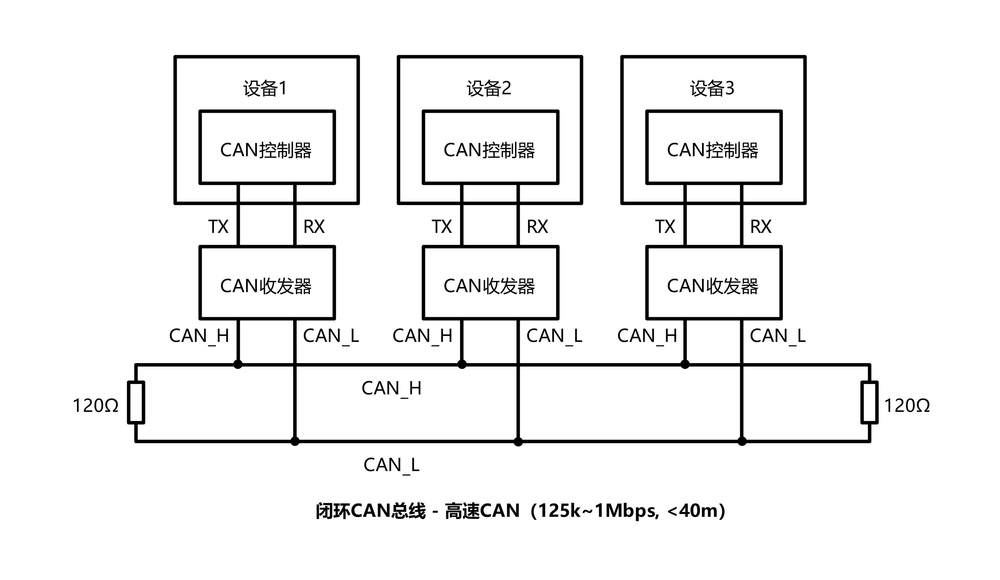

高速CAN使用闭环网络，CAN_H和CAN_L两端添加120Ω的终端电阻

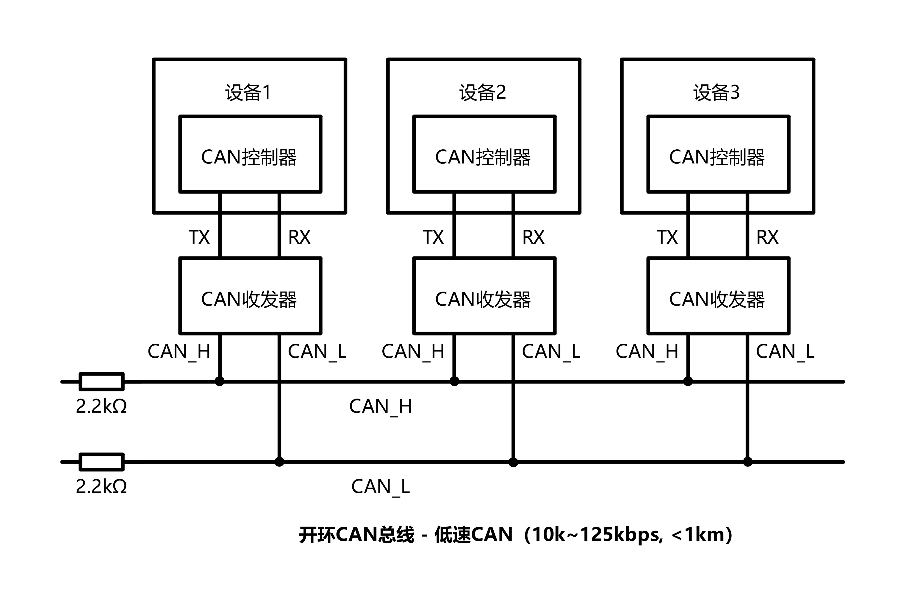

低速CAN使用开环网络，CAN_H和CAN_L其中一端添加2.2kΩ的终端电阻

### CAN 电平标准

CAN总线采用差分信号，即两线电压差（$V_{CAN\_H}-V_{CAN\_L}$）传输数据位

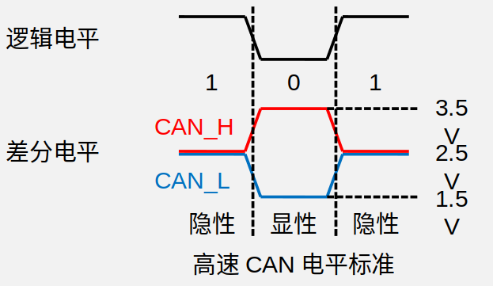

高速CAN：
- 电压差为0V时表示逻辑1（隐性电平-Recessive）
- 电压差为2V时表示逻辑0（显性电平-Dominant）

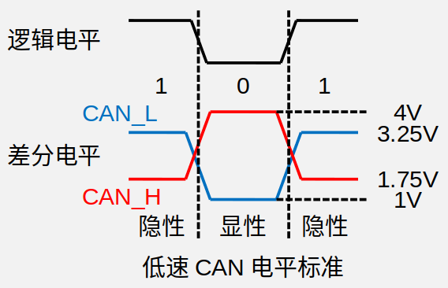

低速CAN：
- 电压差为-1.5V时表示逻辑1（隐性电平-Recessive）
- 电压差为3V时表示逻辑0（显性电平-Dominant）

## CAN 总线帧格式

| 帧类型 |                  用途                  |
| :----: | :------------------------------------: |
| 数据帧 |     发送设备主动发送数据（广播式）     |
| 遥控帧 |     接收设备主动请求数据（请求式）     |
| 错误帧 | 某个设备检测出错误时向其他设备通知错误 |
| 过载帧 |     接收设备通知其尚未做好接收准备     |
| 帧间隔 |  用于江数据帧及遥控帧与前面的帧分离开  |

### 数据帧

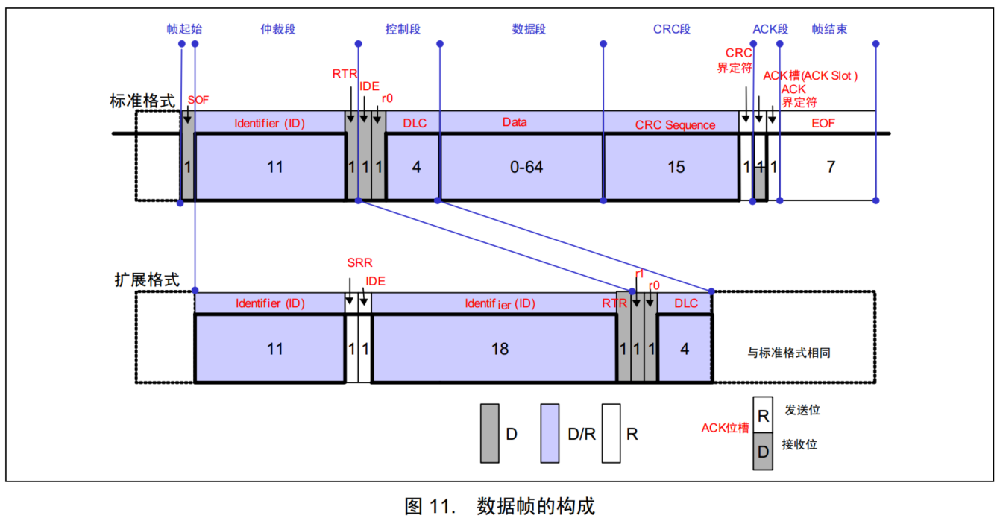

SOF（Start of Frame）：帧起始，表示后面一段波形为传输的数据位  
ID（Identify）：标识符，区分功能，同时决定优先级  
RTR（Remote Transmission Request ）：远程请求位，区分数据帧和遥控帧  
IDE（Identifier Extension）：扩展标志位，区分标准格式和扩展格式  
SRR（Substitute Remote Request）：替代RTR，协议升级时留下的无意义位  
r0/r1（Reserve）：保留位，为后续协议升级留下空间  
DLC（Data Length Code）：数据长度，指示数据段有几个字节  
Data：数据段的1~8个字节有效数据  
CRC（Cyclic Redundancy Check）：循环冗余校验，校验数据是否正确  
ACK（Acknowledgement）：应答位，判断数据有没有被接收方接收  
CRC/ACK界定符：为应答位前后发送方和接收方释放总线留下时间  
EOF（End of Frame ）：帧结束，表示数据位已经传输完毕  

### 遥控帧

遥控帧无数据段，RTR 为隐性电平1，其他部分与数据帧相同

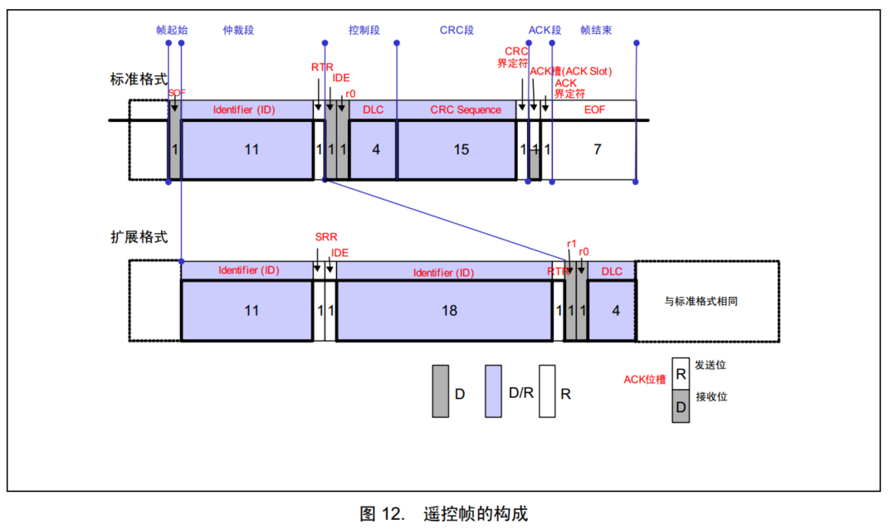

### 错误帧

线上所有设备都会监督总线的数据，一旦发现“位错误”或“填充错误”或“CRC错误”或“格式错误”或“应答错误” ，这些设备便会发出错误帧来破坏数据，同时终止当前的发送设备

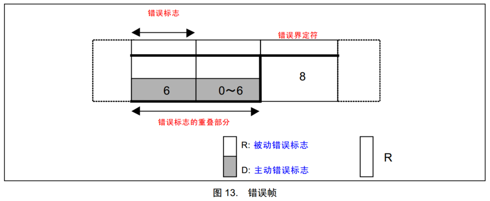

### 过载帧

当接收方收到大量数据而无法处理时，其可以发出过载帧，延缓发送方的数据发送，以平衡总线负载，避免数据丢失

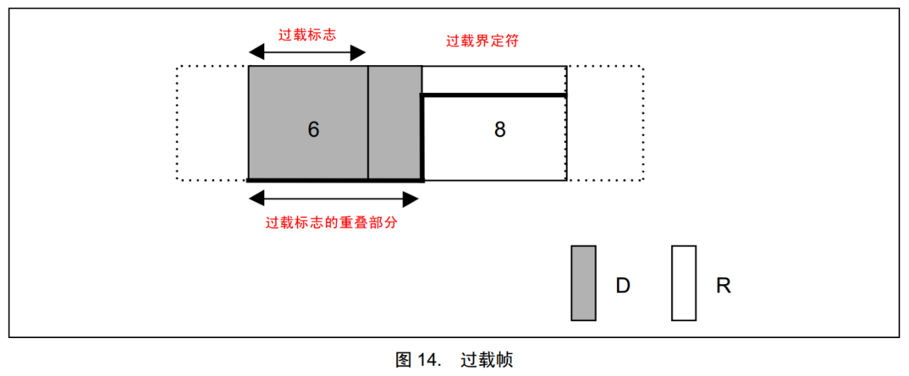

### 帧间隔

将数据帧和遥控帧与错误帧和过载帧分离开

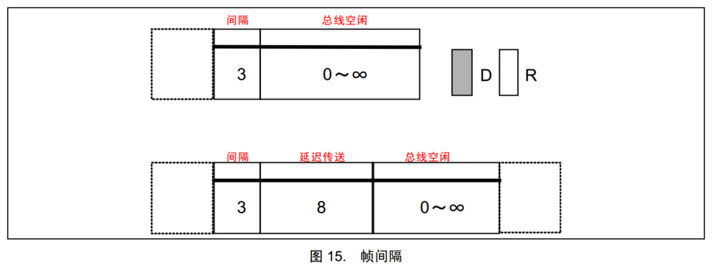

### 位填充

位填充规则：发送方每发送5个相同电平后，自动追加一个相反电平的填充位，接收方检测到填充位时，会自动移除填充位，恢复原始数据

即将发送：1000001111  
实际发送：1000001111100  
实际接收：1000001111100  
移除之后：10000011110  

位填充作用：
- 增加波形的定时信息，利于接收方执行“再同步”，防止波形长时间无变化，导致接收方不能精确掌握数据采样时机  
- 将正常数据流与“错误帧”和“过载帧”区分开，标志“错误帧”和“过载帧”的特异性  
- 保持CAN总线在发送正常数据流时的活跃状态，防止被误认为总线空闲  

## 位时序

CAN总线没有时钟线，总线上的所有设备通过约定波特率的方式确定每一个数据位的时长  
发送方以约定的位时长每隔固定时间输出一个数据位  
接收方以约定的位时长每隔固定时间采样总线的电平，输入一个数据位  
理想状态下，接收方能依次采样到发送方发出的每个数据位，且采样点位于数据位中心附近  

### 接收方数据采样遇到的问题

- 接收方以约定的位时长进行采样，但是采样点没有对齐数据位中心附近

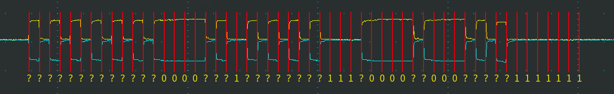

- 接收方刚开始采样正确，但是时间有误差，随着误差累计，采样点逐渐偏离

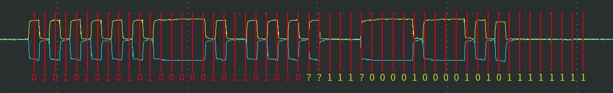

### 位时序

为了灵活调整每个采样点的位置，使采样点对齐数据位中心附近，CAN总线对每一个数据位的时长进行了更细的划分  
分为同步段（SS）、传播时间段（PTS）、相位缓冲段1（PBS1）和相位缓冲段2（PBS2），每个段又由若干个最小时间单位（Tq）构成

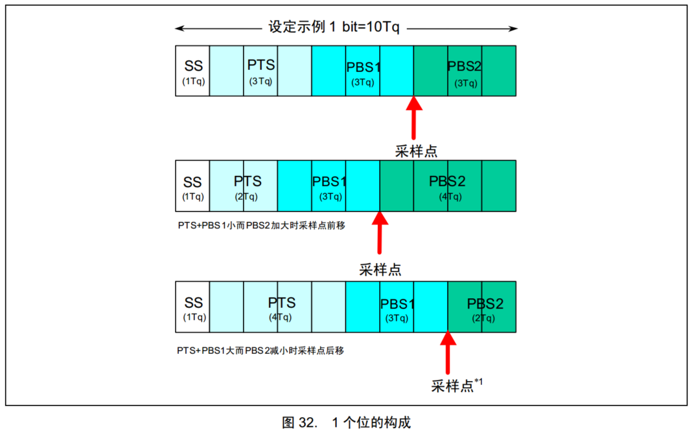

### 硬同步

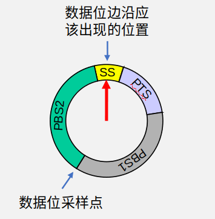

每个设备都有一个位时序计时周期

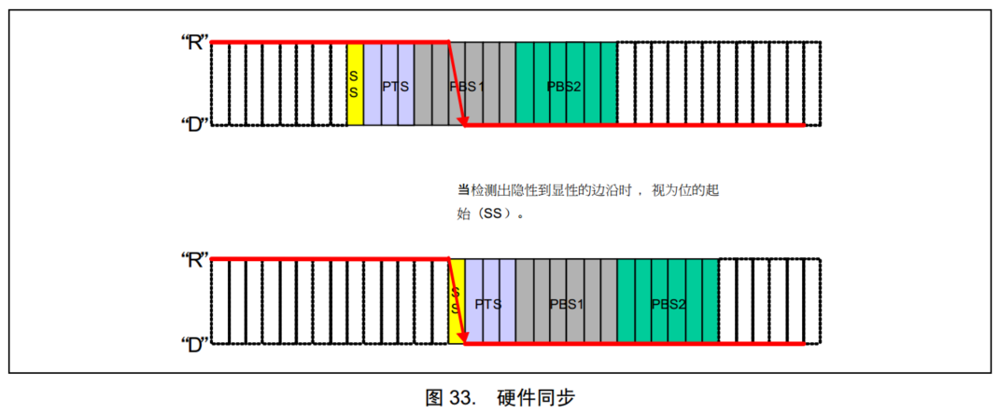

当某个设备率先发送报文，其他所有设备收到SOF的下降沿时，接收方会将自己的位时序计时周期拨到SS段的位置，与发送方的位时序计时周期保持同步

- 硬同步只在SOF下降沿有效
- 经过硬同步后，若发送方和接收方的时钟没有误差，则后续所有数据位的采样点必然都会对齐数据位中心附近

### 再同步

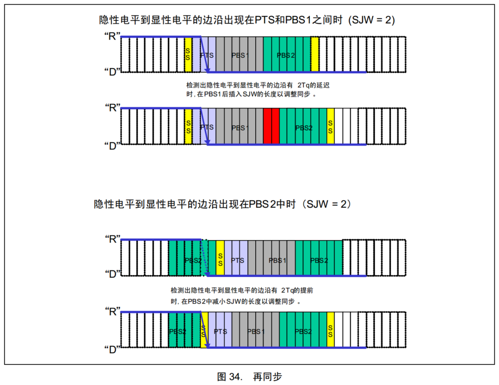

若发送方或接收方的时钟有误差，随着误差积累，数据位边沿逐渐偏离SS段  
则此时接收方根据再同步补偿宽度值（SJW=1~4Tq）通过加长PBS1段，或缩短PBS2段，以调整同步

再同步可以发生在第一个下降沿之后的每个数据位跳变边沿

### 波特率计算

波特率指每秒传输的码元（这里就是bit）数量。

波特率 = 1 / 一个数据位的时长 = 1 / ($T_{SS} + T_{PTS} + T_{PBS1} + T_{PBS2}$)

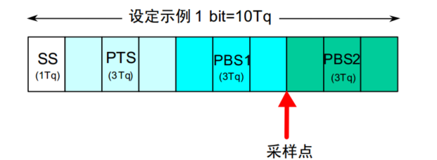

例如：SS=1Tq，PTS=3Tq，PBS1=3Tq，PBS2=3Tq  
Tq = 0.5us  
波特率 = 1 / [(1+3+3+3) * 0.5us] = 200kbps

## 资源分配规则与优先级

同一时间只能有一个设备操作总线发送数据

### 1.先占先得

- 若当前已经有设备正在操作总线发送数据帧/遥控帧，则其他任何设备不能再同时发送数据帧/遥控帧（可以发送错误帧/过载帧破坏当前数据）
- 任何设备检测到连续11个隐性电平，就认为总线空闲，只有在总线空闲时，设备才能发送数据帧/遥控帧
- 一旦有设备正在发送数据帧/遥控帧，总线就会变为活跃状态，必然不会出现连续11个隐性电平(有位填充规则)，其他设备自然也不会破坏当前发送
- 若总线活跃状态其他设备有发送需求，则需要等待总线变为空闲，才能执行发送需求

### 2.非破坏性仲裁

若多个设备的发送需求同时到来或因等待而同时发送，则CAN总线协议会根据ID号进行非破坏性仲裁  
ID号小的(优先级高)取得总线控制权，ID号大的(优先级低)仲裁失败后将转入接收状态，等待下一次总线空闲时再尝试发送

实现非破坏性仲裁的两个要求：
- 线与特性：总线上任何一个设备发送显性电平0时，总线就会呈现显性电平0状态，只有当所有设备都发送隐性电平1时，总线才呈现隐性电平1状态。
- 回读机制：每个设备发出一个数据位后，都会读回总线当前的电平状态，以确认自己发出的电平是否被真实地发送出去，根据线与特性，发出0读回必然是0，发出1读回不一定是1

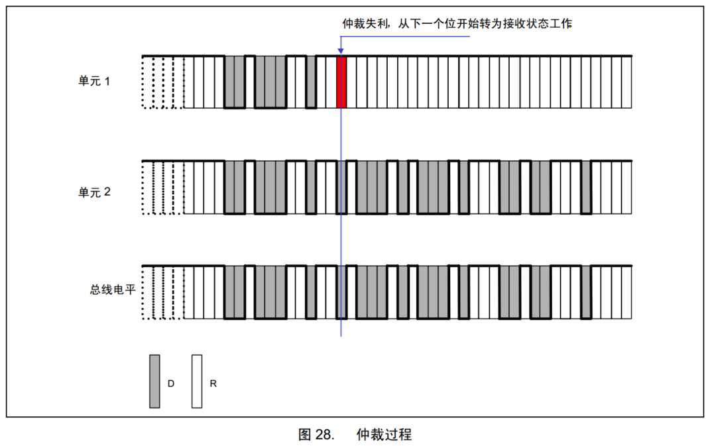

ID号从前到后依次比较，出现差异且数据位为1的设备仲裁失败

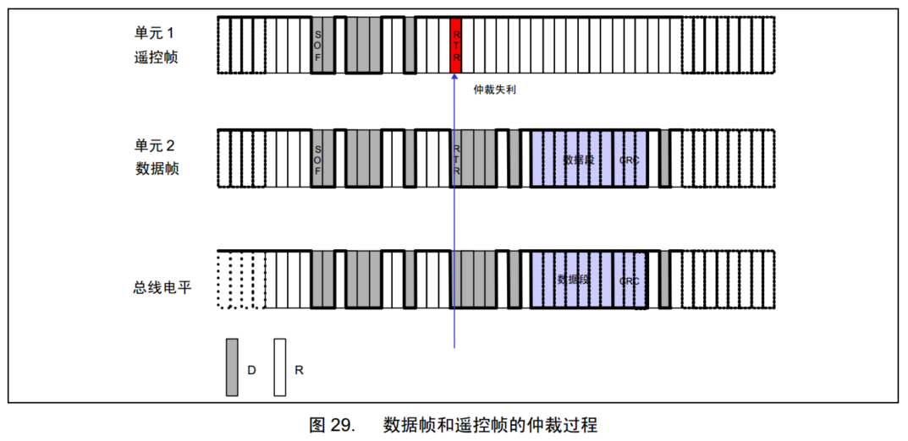

数据帧和遥控帧ID号一样时，数据帧的优先级高于遥控帧（本质上还是因为遥控帧的RTR位为1）

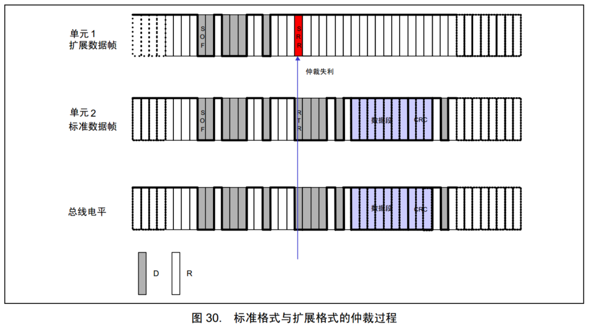

标准格式11位ID号和扩展格式29位ID号的高11位一样时，标准格式的优先级高于拓展格式(SRR位为1保证了此要求)

## 错误

CAN 总线的错误共有五种：位错误、填充错误、CRC错误、格式错误、应答错误

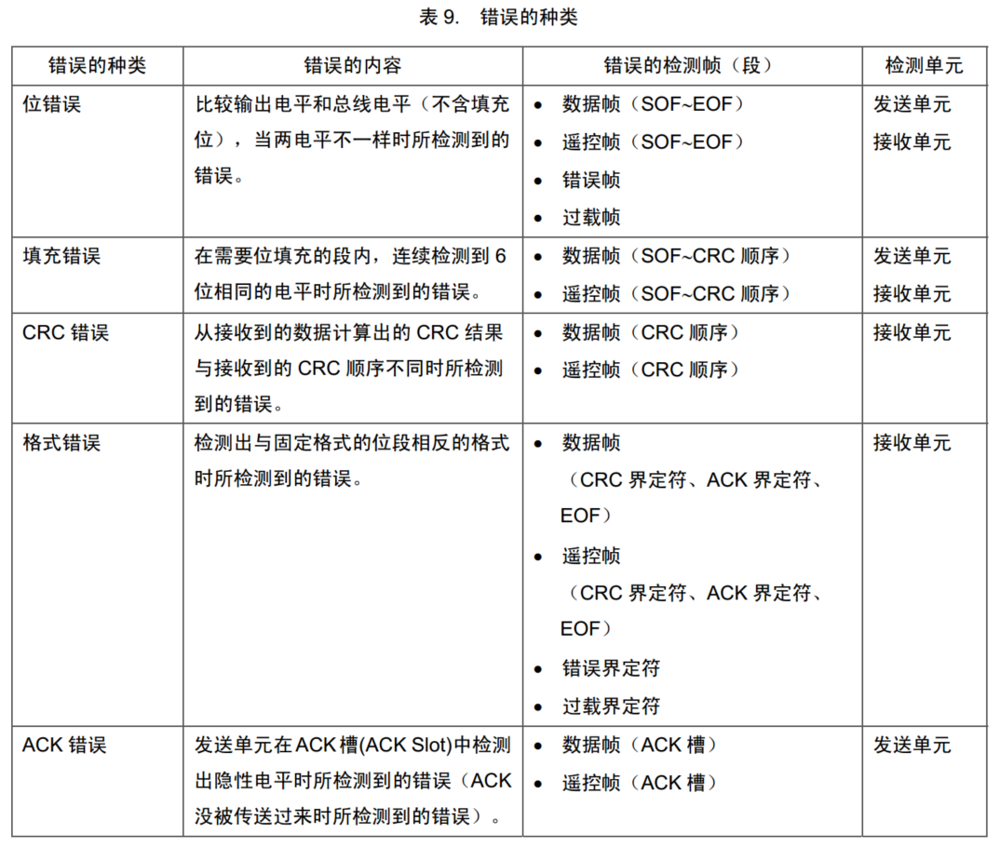

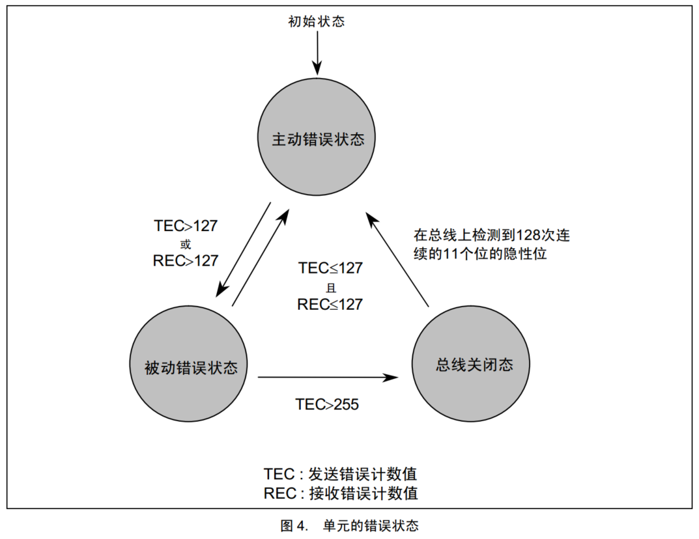

错误状态：
- 主动错误状态的设备正常参与通信并在检测到错误时发出主动错误帧
- 被动错误状态的设备正常参与通信但检测到错误时只能发出被动错误帧
- 总线关闭状态的设备不能参与通信
- 每个设备内部管理一个TEC和REC，根据TEC和REC的值确定自己的状态

