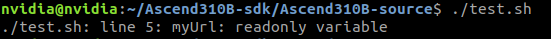

# Shell

Shell 是指一种应用程序，这个应用程序提供了一个界面，用户通过这个界面访问操作系统内核的服务。

Shell 脚本（shell script），是一种为 shell 编写的脚本程序。

在一般情况下使用 bash，人们并不区分 Bourne Shell 和 Bourne Again Shell，所以，像 `#!/bin/sh`，它同样也可以改为 `#!/bin/bash`。

## 第一个 Shell 脚本

```shell
#!/bin/bash
echo "Hello Shell"
```

将上面的代码保存为 `tset.sh`，并 cd 到相应目录：
```bash
chmod +x ./test.sh  # 使脚本具有执行权限
./test.sh           # 执行脚本
```

## Shell 变量

**定义变量**

定义变量时，变量名不加美元符号，如：

```shell
your_name="runoob"
```

变量名和赋值符号之间不能有空格。

除了显式地直接赋值，还可以用语句给变量赋值，如：
```shell
for file in `ls /etc`
或
for file in $(ls /etc)
```

**使用变量**

使用一个定义过的变量，只要在变量名前面加美元符号即可，如：

```shell
your_name="qinjx"
echo ${your_name}
```

花括号虽然是可选的，但是推荐给所有变量加上花括号。

**只读变量**

使用 readonly 命令可以将变量定义为只读变量，只读变量的值不能被改变。

```shell
#!/bin/bash

myUrl="https://www.google.com"
readonly myUrl
myUrl="https://www.baidu.com"
```



**删除变量**

使用 `unset` 命令可以删除变量：
```shell
unset variable_name
```
变量被删除后不能再次使用，`unset`命令不能删除只读变量。

### 变量类型

Shell 支持不同类型的变量。

**字符串变量：**在shell中，变量通常被视为字符串。  
可以使用单引号`'`或双引号`"`来定义字符串：
```shell
my_string='Hello shell'
或
my_string="Hello shell"
```

**整数变量：**在一些Shell中，可以使用 `declare` 或 `typrset` 命令来声明整数变量。
```shell
declare -i my_integer=42
```

**数组变量：**Shell也支持数组，允许在一个变量中存储多个值。

整数索引数组：
```shell
my_array=(1 2 3 4 5)
```

关联数组：
```shell
declare -A associative_array
associative_array["name"]="John"
associative_array["age"]=30
```

**环境变量：**这些是由操作系统或用户设置的特殊变量，用于配置 Shell 的行为和影响其执行环境。
例如，PATH变量包含来操作系统搜索可执行文件的路径：
```shell
echo $PATH
```

**特殊变量：**有一些特殊变量在 Shell 中具有特殊含义，`$0` 表示脚本的名称，`$1` `$2` 表示脚本的参数。`$#` 表示传递给脚本的参数数量，`$?` 表示上一个命令的退出状态。

### Shell 字符串

字符串是 Shell 编程中最常用最有用的数据类型，字符串可以用单引号，也可以用双引号，也可以不用引号。

**单引号**
- 单引号里的任何字符串都会原样输出，单引号字符串中的变量是无效的；
- 单引号字符串中不能出现单独一个单引号（转义也无效），但可成对出现，作为字符串拼接使用。

**双引号**
- 双引号里可以有变量
- 双引号里可以出现转义字符

**获取字符串长度**
```shell
string="abcd"
echo ${#string}
# 等价于
echo ${#string[0]}
```

> `#` 的使用
> 
> **对于变量**
> `${#变量名}` 返回变量的值在字符或字节意义上的长度。
> **对于数组**
> `${#array[@]}` 或 `${#array[*]}` 返回数组的元素个数。
> `${#array[索引]}` 返回该索引位置的元素长度。

**提取子字符串**
从0开始数
```shell
#!/bin/bash

string="runoob is a great site"
echo ${string:2:3} # 输出 noo 从第2个字符开始截取3个字符

string="runoob is a great site"
echo ${string:2:-1} # 输出 noob is a great sit

string="runoob is a great site"
echo ${string:2:${#string}} # 输出 noob is a great site
```

**查找字符**
查找字符 i 或 o 的位置(从1开始数)：
```shell
string="runoob is a great site"
echo `expr index "$string" "io"`  # 输出 4

string="runoob is a great site"
echo `expr index "$string" "ag "`  # 输出 7
```

### Shell 数组
在Shell中，用括号来表示数组，数组元素用 ` ` 空格分割开。
**定义数组**
```shell
array_name=(value0 value1 value2 value3)

array_name=(
    value0
    value1
    value2
    value3
)

array_name[0]=value0
array_name[1]=value1
array_name[n]=valuen
```
单独定义数字的各个分量时，可以不使用连续的下标，而且下标的范围没有限制。

**读取数组**
读取数组元素值：
```shell
valuen=${array_name[n]}

# 使用 @ 符号可以获取数组中的所有元素
echo ${array_name[@]}
```

**关联数组**
Bash 支持关联数组，可以使用任意的字符串或者整数作为下标来访问数组元素。
```shell
declare -A site=(["google"]="www.google.com" ["taobao"]="www.taobao.com")
```

**获取数组中的所有元素**
使用 `@` 或 `*` 可以获取数组中的所有元素。
```shell
echo "数组的元素为: ${site  [*]}"
echo "数组的元素为: ${site[@]}"
```
**获取数组的所有键**
在数组前加一个感叹号 `!` 可以获取数组的所有键，例如:
```shell
echo "数组的键为: ${!site[*]}"
echo "数组的键为: ${!site[@]}"
```


## Shell 传递参数
在执行 Shell 脚本时，向脚本传递参数，脚本内获取参数的格式为`$n`，n代表执行脚本的第n个参数。`$0` 为执行的脚本名。

| 参数处理 | 说明                                                   |
| :------- | :----------------------------------------------------- |
| $#       | 传递到脚本的参数个数                                   |
| $*       | 以一个单字符串显示所有向脚本传递的参数，"$1 $2 ... $n" |
| $$       | 脚本运行的当前进程 ID 号                               |
| $!       | 后台运行的最后一个进程的 ID 号                         |
| $@       | 与 $* 相似，但使用时加引号，并在引号中返回每个参数     |
| $-       | 显示 Shell 使用的当前选项                              |
| $?       | 显示最后命令的退出状态                                 |

## Shell 基本运算符
Shell 和其他编程语言一样，支持多种运算符：
- 算数运算符
- 关系运算符
- 布尔运算符
- 字符串运算符
- 文件测试运算符

原生bash 不支持简单的数学计算，但是可以通过其他命令来实现，例如 `awk` `expr` 和 `dc`。

```shell
val=$((a * b))
echo "a * b : $val"
```

**关系运算符**
关系运算符只支持数字，不支持字符串。

| 运算符 | 说明                                               |
| :----- | :------------------------------------------------- |
| -eq    | 检测两个数是否相等，相等返回true                   |
| -ne    | 检测两个数是否不相等，不相等返回true               |
| -gt    | 检测左边的数是否大于右边的，如果是，则返回true     |
| -lt    | 检测左边的数是否小于右边的，如果是，则返回true     |
| -ge    | 检测左边的数是否大于等于右边的，如果是，则返回true |
| -le    | 检测左边的数是否小于等于右边的，如果是，则返回true |

```shell
if [ $a -eq $b ]
then
    echo "$a -eq $b: a 等于 b"
else
    echo "$a -eq $b: a 不等于 b"
fi
```

**布尔运算符**
| 运算符 | 说明                                          |
| :----- | :-------------------------------------------- |
| -a     | 与运算，两个表达式都为true才返回true          |
| -o     | 或运算，有一个表达式为true则返回true          |
| !      | 非运算，表达式为true则返回false，否则返回true |

> `-a` `-o` 已经过时

**逻辑运算符**
| 运算符 | 说明       |
| :----- | :--------- |
| &&     | 逻辑的 AND |
| \|\|   | 逻辑的 OR  |

```shell
#!/bin/bash

a=10
b=20

if [[ $a -lt 100 && $b -gt 100 ]]
then
   echo "返回 true"
else
   echo "返回 false"
fi

if [ $a -lt 100 ] || [ $b -gt 100 ]
then
   echo "返回 true"
else
   echo "返回 false"
fi
```

**字符串运算符**

| 运算符 | 说明                                      |
| :----- | :---------------------------------------- |
| =      | 检测两个字符串是否相等，相等返回 true     |
| !=     | 检测两个字符串是否不相等，不相等返回 true |
| -z     | 检测字符串长度是否为0，为0返回true        |
| -n     | 检测字符串长度是否不为0，不为0返回true    |
| $      | 检测字符串是否不为空，不为空返回true      |

**文件测试运算符**

| 操作符  | 说明                                                                     |
| :------ | :----------------------------------------------------------------------- |
| -r file | 检测文件是否可读，如果是，则返回 true                                    |
| -w file | 检测文件是否可写，如果是，则返回 true                                    |
| -x file | 检测文件是否可执行，如果是，则返回 true                                  |
| -s file | 检测文件是否为空（文件大小是否大于0），不为空返回true                    |
| -e file | 检测文件（包括目录）是否存在，如果是，则返回true                         |
| -b file | 检测文件是否是块设备文件，如果是，则返回true                             |
| -c file | 检测文件是否是字符设备文件，如果是，则返回true                           |
| -d file | 检测文件是否是目录，如果是，则返回true                                   |
| -f file | 检测文件是否是普通文件（既不是目录，也不是设备文件），如果是，则返回true |

**自增和自减操作符**
```shell
#!/bin/bash

num=5

let num++
let num--

num=$((num + 1))
num=$((num - 1))

((num++))
((num--))
```

## Shell echo 命令
echo 是个内置的 shell 命令，用于在标准输出显示一行文本或变量的值。

`-n` 选项：不换行输出
默认情况下，echo 会在输出后添加换行符，使用 -n 可以禁止这种行为。

`-e` 选项：启用转义字符解释
启用对反斜杠转义的解释。

### 高级用法

**1. 输出到文件**
使用重定向将输出保存到文件：
```shell
echo "This will be saved to file" > output.txt
# 追加内容到文件：
echo "Additional line" >> output.txt
```

**2. 彩色输出**
使用 ANSI 转义码实现彩色文本：
```shell
echo -e "\033[31mRed Text\033[0m"
echo -e "\033[42;31mGreen Background with Red Text\033[0m"
```

> ANSI 转义序列通常由三部分组成：
> 1. 转义字符(ESC)：序列的开始，告诉终端“接下来是一条指令”
>     - 常见表示方式：`\x1b` `\033` 或 `\e`
> 2. 控制序列引导码(CSI)：紧跟在ESC后面的一个或多个字符，最常用的是`[`
> 3. 参数和命令：一个或多个参数用`;`分隔，后跟一个表示具体命令的字母。
>
> 常用的功能有：文本样式和颜色、光标控制、清屏与清行
> 如果将带有转义码的输出重定向到文件，文件中会包含这些原始字符，导致文件内容杂乱。因此，在非交互式环境中（如日志文件）应避免使用。
>
> **文本样式和颜色**
> |效果|代码|
> |:--|:--|
> |**重置所有样式**|\x1b[0m|
> |粗体|\x1b[1m|
> |下划线|\x1b[4m|
> |**前景色(字体颜色)**||
> |黑色|\x1b[30m|
> |红色|\x1b[31m|
> |绿色|\x1b[32m|
> |黄色|\x1b[33m|
> |蓝色|\x1b[34m|
> |**背景色**||
> |黑色背景|\x1b[40m|
> |红色背景|\x1b[41m|
> |绿色背景|\x1b[42m|
> |黄色背景|\x1b[43m|
> 
> **光标控制**
> |效果|代码|
> |:--|:--|
> |上移n行|\x1b[{n}A|
> |下移n行|\x1b[{n}B|
> |右移n列|\x1b[{n}C|
> |左移n列|\x1b[{n}D|
> |移动到指定位置|\x1b[{行};{列}H|
>
> **清屏与清行**
> |效果|代码|
> |:--|:--|
> |清除当前行|\x1b[2K|
> |清除屏幕|\x1b[2J|
> |回车不换行(光标移到行首)|\r|

**3. 输出命令执行结果**
使用命令替换输出命令结果：
```shell
echo "Today is $(date)"
```

生成配置文件的示例：
```shell
sudo tee /etc/myapp.conf <<EOF
# Generated by script on $(date)
[Database]
host = localhost
port = 3306
user = appuser
password = secret123
EOF
```

## Shell printf 命令

用起来和 C 的差不多：
`printf format-string [arguments...]`


printf 实现的进度条：
```shell
#!/bin/bash

for i in {1..20}; do
    printf "\rProgress: [%-20s] %d%%" $(printf "%${i}s" | tr ' ' '#') $((i*5))
    sleep 0.1
done
printf "\n"


# 字段宽度和对齐(指定宽度后 - 是左对齐)
printf "|%10s|\n|%-10s|\n" "right" "left"
```

## Shell 流程控制
sh 的流程控制不可为空。

### if else

**if**
```shell
if condition
then
   command1
   command2
   ...
fi
```

写成一行：
`if [ $(ps -ef | grep -c "ssh") -gt 1 ]; then echo "true"; fi`

**if else**
```shell
if condition
then
   command1
   command2
   ...
else
   command
fi
```

**if else-if else**
```shell
if condition1
then
   command1
elif
   condition2
then
   command2
else
   command3
fi
```

### for 循环
```shell
for var in item1 item2 ... itemN
do
   command1
   command2
   ...
done
```

### while 语句
while 循环用于不断执行一系列命令，也用于从输入文件中读取数据
```shell
while condition
do
   command
done
```

### until 循环
until 循环执行命令直到条件为 true 时停止。
```shell
until condition
do
   command
done
```

### case...ease
多选择语句，每个case分支用右圆括号开始，用两个分号`;;`表示break、
```shell
case 值 in
模式1)
   command1
   ...
   ;;
模式2)
   command1
   ...
   ;;
esac
```

Shell 也是用 break 和 continue 跳出循环的。

## Shell 函数
linux Shell 可以用户定义函数，然后在 shell 脚本中可以随意调用。
```shell
[ function ] funname [()]
{
   action;
   [return int;]
}
```

参数返回，return显式返回数值（0~255），如果不加return，将以最后一条命令运行结果，作为返回值。

函数返回值在调用函数后疼偶 `$?` 来获得
```shell
#!/bin/bash
# author:菜鸟教程
# url:www.runoob.com

funWithReturn(){
    echo "这个函数会对输入的两个数字进行相加运算..."
    echo "输入第一个数字: "
    read aNum
    echo "输入第二个数字: "
    read anotherNum
    echo "两个数字分别为 $aNum 和 $anotherNum !"
    return $(($aNum+$anotherNum))
}
funWithReturn
echo "输入的两个数字之和为 $? !"
```

## Shell 输入输出重定向
| 命令            | 说明                                             |
| :-------------- | :----------------------------------------------- |
| command > file  | 将输出重定向到 file                              |
| command < file  | 将输入重定向到 file                              |
| command >> file | 将输出以追加的方式重定向到 file                  |
| n > file        | 将文件描述符为 n 的文件重定向到 file             |
| n >> file       | 将文件描述符为 n 的文件以追加的方式重定向到 file |
| n>&m          | 将输出文件 m 和 n 合并                           |
| n<&m          | 将输入文件 m 和 n 合并                           |
| <<tag           | 将开始标记 tag 和结束标记 tag 之间的内容作为输入 |

> 文件描述符 0 通常是标准输入(STDIN)，1 是标准输出(STDOUT), 2 是标准错误输出(STDERR)

**重定向身躯**
一般情况下，每个Linux命令运行时都会打开三个文件：
- 标准输入文件(stdin)：文件描述符为0
- 标准输出文件(stdout)：文件描述符为1
- 标准错误文件(stderr)：文件描述符为2

如果希望 stderr 重定向到 file：
```shell
$ command 2>file
```
如果希望 stdout 和 stderr合并后重定向：
```shell
$ command > file 2>&1
```

### Here Document
Here Document 是 Shell 中的一种特殊的重定向方式，用来将输入重定向到一个交互式Shell脚本或程序。
```shell
command << delimiter
   document
delimiter
```

它的作用是将两个 delimiter 之间的内容作为输入传递给 command。

**/dev/null 文件**
如果希望执行某个命令，但又不希望在屏幕上输出结果，可以将输出重定向到 /dev/null。

## Shell 文件包含
Shell 也可以包含外部脚本，这样可以封装公用代码作为一个独立的文件
```shell
. filename.sh

或

source filename
```